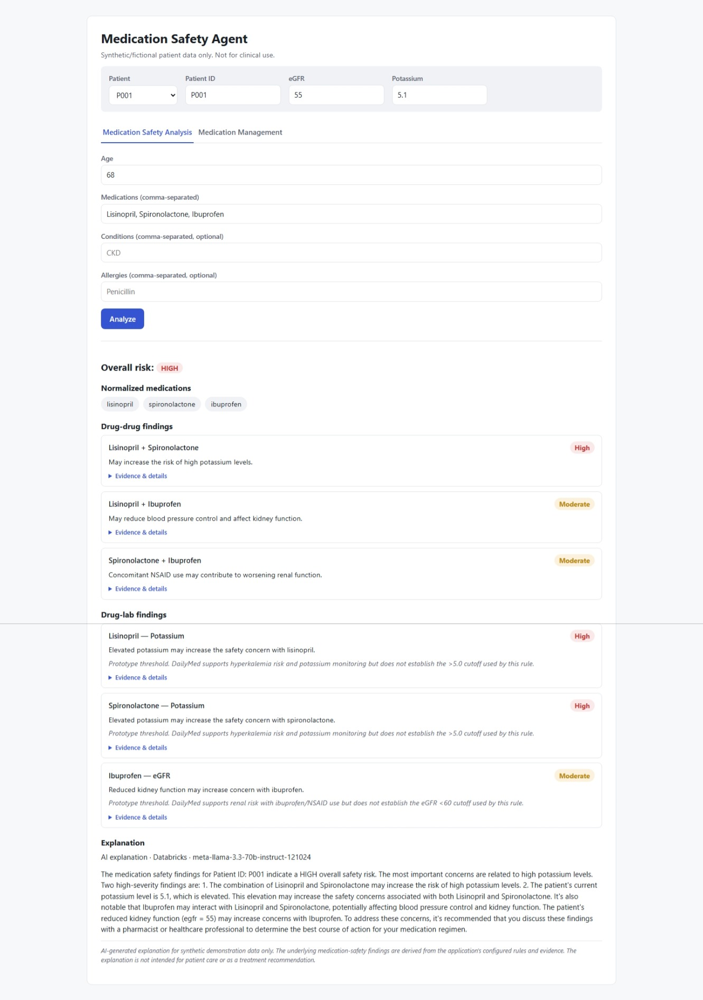
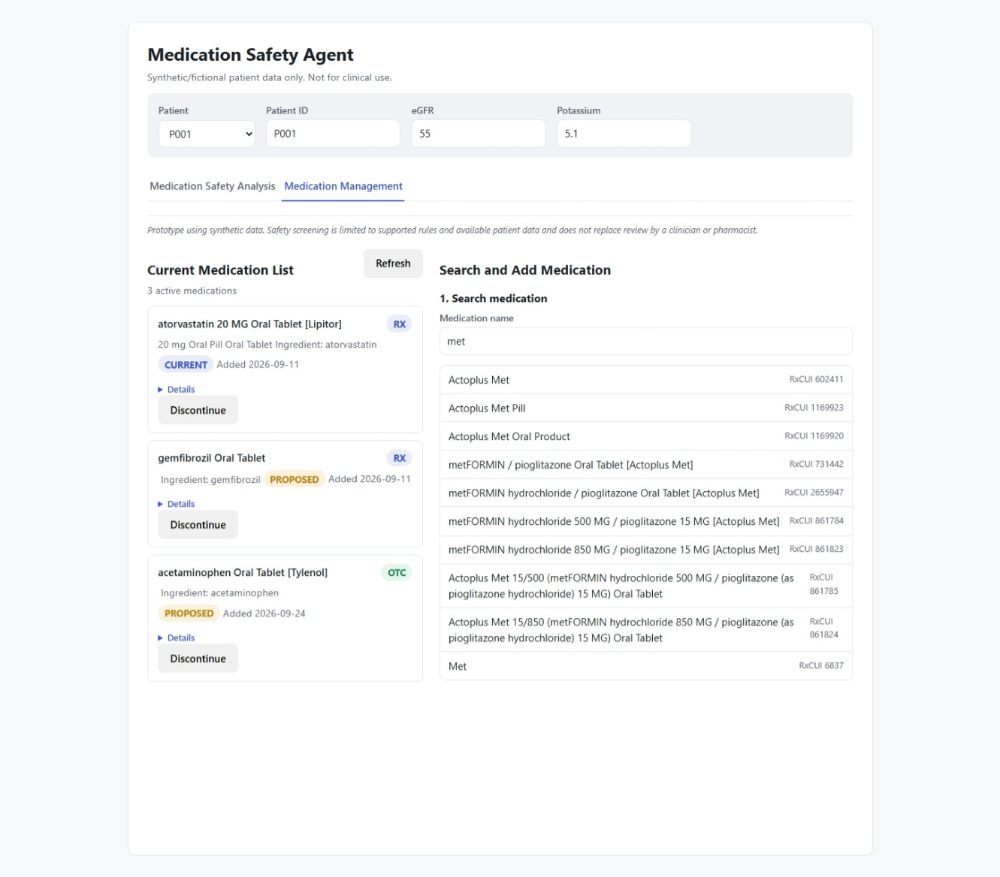
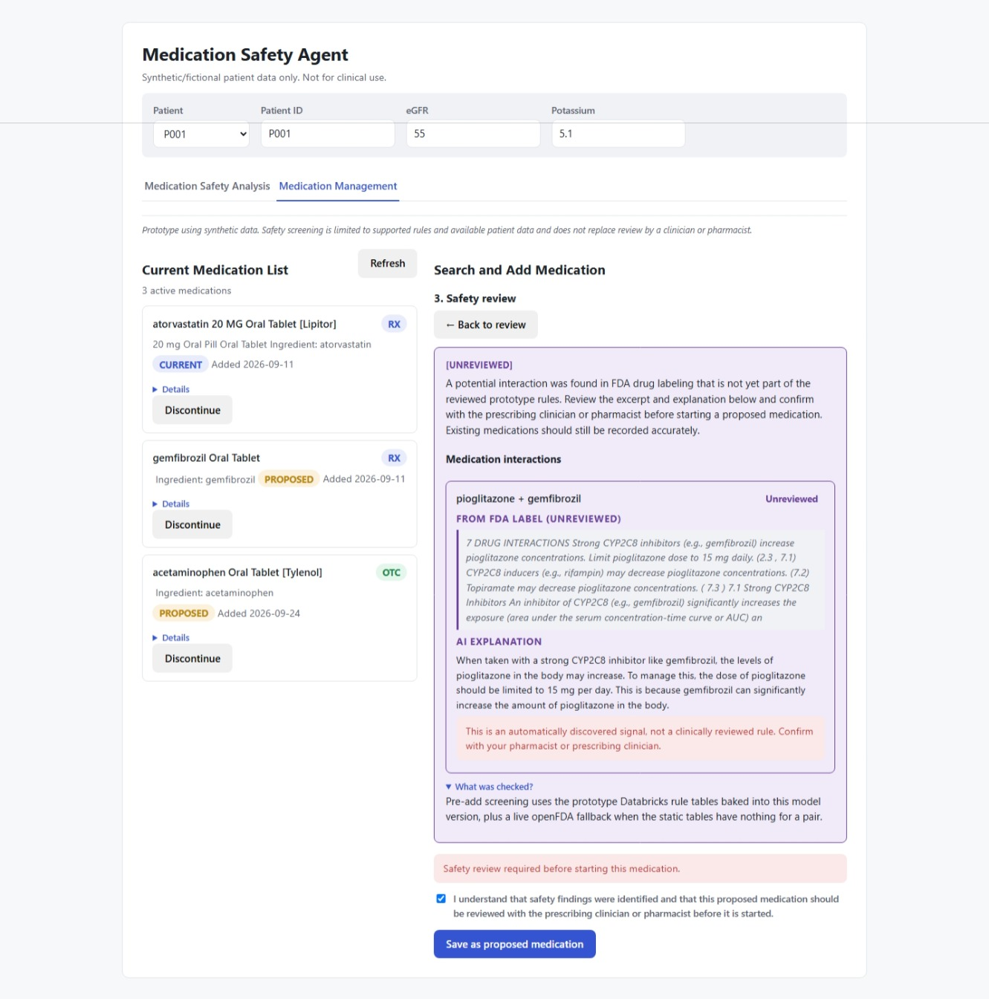
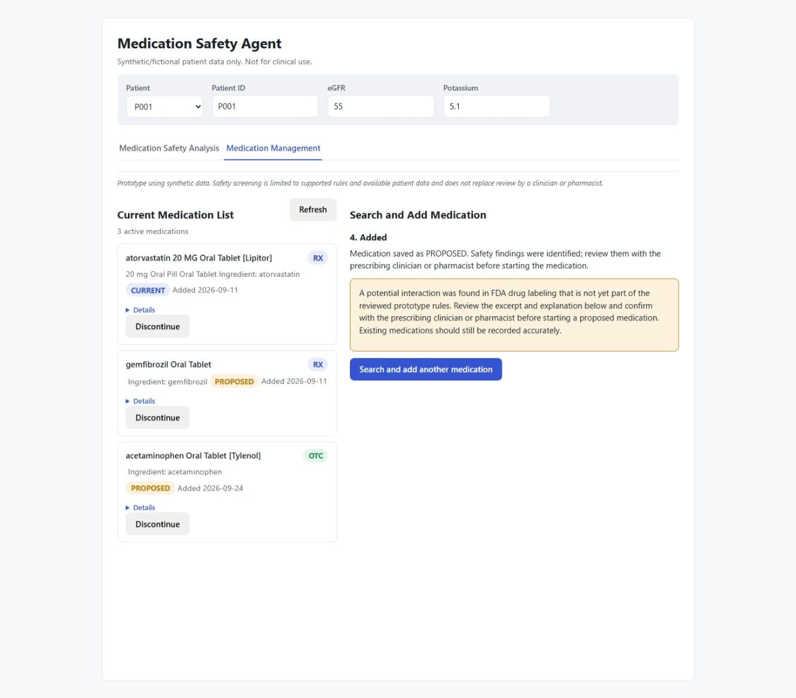

# Medication Safety Agent

> **Demonstration only.** This project uses synthetic data and is intended for educational and portfolio
> purposes. It is not a medical device, clinical decision-support product, or substitute for professional
> medical judgment, and it is not intended for use in patient care.

A thin FastAPI web client over a Databricks Model Serving endpoint, giving one application two capabilities
that share a single patient context: **Medication Safety Analysis** (deterministic drug-drug/drug-lab rules,
evidence-cited, with an AI-generated plain-language explanation) and **Medication Management** (search,
review, safety-check, add, and discontinue a patient's medications).

The app never reimplements clinical logic itself. Rules determine facts; an LLM only explains findings that
already exist — it cannot create or change them.

## Screenshots

**Medication Safety Analysis**



Medication safety analysis using deterministic drug-drug and drug-lab rules, with evidence-linked findings and a Databricks-hosted AI explanation.

**Medication lookup**



Medication Management uses RxNorm search while preserving the same synthetic patient context across both application tabs.

**Pre-add medication safety review**



A proposed medication is screened before persistence using curated safety rules, with FDA-label fallback evidence clearly identified when applicable.

**Medication discontinuation**



After a soft-discontinue operation, the medication is removed from the active list while the workflow preserves medication history.

A few more screenshots (initial form, current-medication list, and the discontinue confirmation step) are in [docs/images/](docs/images/) for anyone who wants a fuller walkthrough.

## Architecture

```
Browser
  └─ FastAPI (Jinja2 + Alpine.js, no build step)
       ├─ Medication Safety Analysis  ──►  medication-safety-agent  (Databricks Model Serving)
       └─ Medication Management
            ├─ search / details / list / add / discontinue  ──►  Unity Catalog (SQL Statement Execution API) + RxNorm
            └─ pre-add safety check                          ──►  medication-safety-agent (pre_add_check action)
```

One Databricks Model Serving endpoint, `medication-safety-agent`, owns everything genuinely clinical:
- Deterministic drug-drug and drug-lab rule matching against a curated table (rules and their supporting
  DailyMed evidence are stored separately — evidence never becomes a rule automatically).
- A conditional step afterward: a Databricks foundation-model endpoint
  (`databricks-meta-llama-3-3-70b-instruct`) turns the already-established findings into a plain-language
  explanation. The model is instructed not to invent findings, and the API response includes the actual
  provider/model that generated the text (`explanation_provider`, `explanation_model`) so the UI can show
  real runtime metadata instead of a hardcoded label.

Medication Management's CRUD/lookup (search, list, add, discontinue) is deterministic and has no need for
model inference, so it runs directly in FastAPI against Unity Catalog (via the Databricks SQL Statement
Execution API) and the public NLM RxNorm/RxTerms API — see
[docs/databricks-endpoint-lifecycle.md](docs/databricks-endpoint-lifecycle.md) for why this moved out of a
second Model Serving endpoint (`medication-lookup-api`, now retired from active serving). The one genuinely
clinical step in that workflow — the pre-add safety check — still runs centrally through
`medication-safety-agent`, reusing the same rule table as the main analysis.

## Why `medication-lookup-api` was retired

Its workload was almost entirely deterministic lookup/CRUD — 6 of its 7 actions never touched a model at
all, and the 7th only conditionally called a *foundation-model* endpoint for a paraphrase. Model Serving was
being used there as a generic authenticated-CRUD proxy, not for inference. Retiring it also freed up a
serving-endpoint slot under the two-custom-endpoint limit observed in the Free Edition workspace used for
this prototype. Its registered model is kept intact in Unity Catalog as
recovery material; only the serving endpoint and this app's dependency on it were removed. Full detail in
[docs/databricks-endpoint-lifecycle.md](docs/databricks-endpoint-lifecycle.md).

## Features

**Medication Safety Analysis**
- Patient input form (demographics, medications, conditions, allergies, labs) shared with Medication
  Management via one context bar.
- Color-coded overall risk badge, derived from the highest-severity finding.
- RxNorm-normalized medication list showing what the backend actually matched against.
- Drug-drug and drug-lab findings as severity-badged cards with expandable evidence (source, section,
  evidence ID).
- AI-generated explanation, labeled with the real provider/model that produced it, with a disclaimer and
  markdown normalized to plain text (no raw `**...**`).

**Medication Management**
- Shared patient/lab context bar so the two tabs can never disagree about who's being analyzed.
- Health-check gating: pings dependencies once per tab load; on failure, disables writes while keeping
  existing data visible.
- Active medication list with an inline, confirmed Discontinue flow (soft delete, preserved for history).
- 4-step add wizard — Search → Review → Safety Check → Add — with debounced, race-guarded RxNorm search.
- Acknowledgement-gated add: High/Moderate/Unreviewed findings require an explicit checkbox before a
  Proposed or Current medication can be saved.
- Stale-result detection: changing labs after a safety check invalidates it, forcing a re-check.
- Duplicate-add and timeout handling: duplicates are surfaced as information (not errors); a timed-out add
  reconciles against the live list before offering Retry.
- Dynamic "Unreviewed" fallback: when the curated rule table has nothing for a pair, a live openFDA label
  lookup surfaces the interaction with a trusted excerpt, an AI paraphrase, and a clinician-review
  disclaimer — the excerpt is the fact, the AI only paraphrases it.

## Implemented vs. future capabilities

| Area | Status |
|---|---|
| Drug-drug / drug-lab rule engine, evidence citations | Implemented (curated table: Lisinopril, Spironolactone, Ibuprofen) |
| AI explanation with provider/model transparency | Implemented |
| Medication Management CRUD against Unity Catalog | Implemented |
| openFDA "Unreviewed" fallback + self-reinforcing rule learning | Implemented |
| Offline/demo mode (no Databricks required) | Implemented — see below |
| Broader curated drug coverage | Not implemented (prototype scope is intentionally 3 drugs) |
| Authentication / multi-tenant access control | Not implemented (single-user prototype) |
| SMART on FHIR / real EHR integration | Not implemented |

## Running locally

### Demo mode (no Databricks account needed)

```bash
uv sync
DEMO_MODE=true uv run uvicorn app.main:app --reload
```

Open `http://127.0.0.1:8000/`. A banner marks the app as running in demo mode. The three seed patients
(P001/P002/P003) show real findings and evidence captured from a live run of the deployed endpoint, replayed
locally — the rule-matching logic (drug-drug/drug-lab table lookups) is genuinely re-evaluated from that same
captured rule table, only the network call to Databricks is skipped. The AI explanation text is a fixed,
clearly labeled canned string, not live-generated. Medication Management's add/discontinue/list flow runs
against an in-memory store that resets whenever the process restarts. RxNorm search/details stay live in
demo mode too — it's a public API that needs no credentials. Outside the three seed patients and three
curated drugs, demo mode says explicitly that it has no coverage rather than fabricating a plausible-looking
result. See `app/services/demo_fixtures.py` and `app/services/demo_store.py`.

### Live mode (your own Databricks workspace)

1. Register `databricks/01-medication-safety-agent.py` as a Unity Catalog model version, then deploy it with
   `uv run python scripts/deploy_endpoints.py --target-version <N> --apply` (idempotent: creates the
   endpoint if missing, updates it if it's serving a different version, no-ops if already correct, and
   never deletes/recreates it just because the version changed). The approved version is never hard-coded
   in that script — pass `--target-version`, set `MEDICATION_SAFETY_AGENT_TARGET_VERSION`, or pass
   `--resolve-latest-ready` (opt-in; picks the highest READY version, which is not the same as "clinically
   approved" — see the script's docstring). See
   [docs/databricks-endpoint-lifecycle.md](docs/databricks-endpoint-lifecycle.md) for the full lifecycle.
2. Create a Unity Catalog schema with `patient_medications` and `rxnorm_medication_cache` tables, and a SQL
   warehouse.
3. Copy `.env.example` to `.env` and fill in your own `DATABRICKS_PROFILE` (from `databricks auth login`),
   `SERVING_ENDPOINT_NAME`, `DATABRICKS_WAREHOUSE_ID`, `UNITY_CATALOG`, and `UNITY_SCHEMA`.
4. `uv sync && uv run uvicorn app.main:app --reload`

## Tests

```bash
uv sync --group dev
uv run pytest
```

52 tests across 8 files, all offline by default — no Databricks credentials, no live serving endpoint, and
no network access required (RxNorm calls are mocked in tests; the demo-mode tests assert the Databricks SDK
client is never even constructed). There are currently no tests that require live infrastructure, so there is
nothing to gate behind an opt-in marker today; if a live integration test is ever added, it should be marked
`live_databricks` and excluded from the default run.

## Technologies & APIs used

| Category | Technologies |
|---|---|
| Backend | Python 3.11+, FastAPI, Uvicorn, Jinja2, Pydantic / pydantic-settings, `databricks-sdk`, `uv` |
| Frontend | Server-rendered Jinja2 HTML + Alpine.js v3.14.9 (vendored locally, MIT License, no CDN, no build step), hand-written CSS |
| Testing | pytest, httpx, FastAPI `TestClient`, `unittest.mock` |
| Databricks platform | Model Serving, Unity Catalog managed Delta tables, MLflow `pyfunc` model packaging & registry/versioning, Databricks SQL Statement Execution API |
| External data & AI APIs | NLM RxNorm + RxTerms (`rxnav.nlm.nih.gov`), DailyMed-sourced curated evidence, openFDA drug label API, `databricks-meta-llama-3-3-70b-instruct` |

## Notable engineering moments

- **No Spark session in a serving container.** The original notebook loaded rule/evidence tables via
  `spark.table(...).collect()` at notebook scope — unavailable inside Model Serving. Fixed by snapshotting
  the data to plain Python structures at model-logging time.
- **`Decimal` isn't JSON-serializable.** A Unity Catalog `DECIMAL` column came back as `decimal.Decimal`,
  which MLflow's response serializer can't encode. Fixed with a recursive `Decimal → float` conversion at
  logging time.
- **Real input schema stricter than documented.** The deployed model's `labs` field turned out to be locked
  to exactly `{egfr: int, potassium: float}`, not a free-form map, discovered via a live 502 and then encoded
  as the real Pydantic schema.
- **Unity Catalog write permissions.** Writes failed with `PERMISSION_DENIED` because the endpoint runs as a
  service principal, not the deploying user, and automatic credential vending only grants read by default.
  Every re-logged model version mints a new service-principal identity, so grants must be reapplied on every
  redeploy — confirmed across multiple redeploys in this project.
- **Self-pair matching bug.** Checking a medication whose ingredient RxCUI matched one already on file caused
  the openFDA fallback to match a drug's label against itself. Fixed with an explicit identity skip.
- **Duplicate rule inserts under cache staleness.** A second add for the same drug pair could re-trigger the
  discover-and-persist path before the write from a previous request was visible. Fixed by checking for the
  deterministic evidence ID before inserting, making the persist step idempotent.
- **Retry-storm created orphaned model versions.** The SDK's automatic HTTP retry logic silently re-executed
  a model registration call, producing three registered versions from what should have been one redeploy.
  Fixed by adding an explicit code-version marker to the health-check response so any deploy can be verified
  unambiguously.

## License

MIT — see [LICENSE](LICENSE). The synthetic-data/not-for-clinical-use disclaimer above is a usage notice, not
a license term, and applies regardless of how the code is reused.
